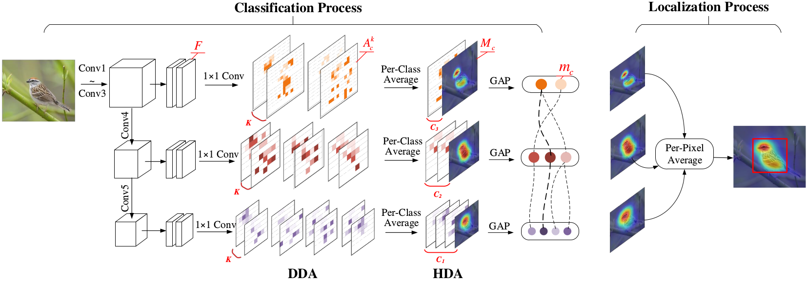
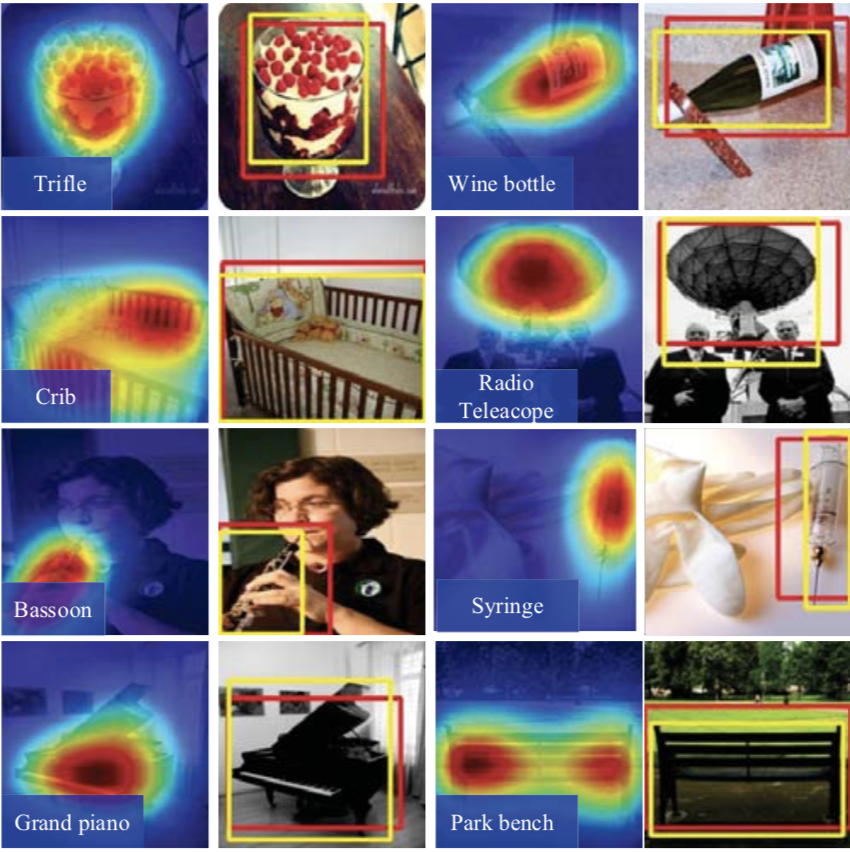

# DANet
DANet: Divergent Activation for Weakly Supervised Object Localization，in ICCV 2019
## Overview of DANet
We propose a divergent activation (DA) approach, and target at learning complementary and discriminative visual patterns for image classification and weakly supervised object localization from the perspective of discrepancy. To this end, we design hierarchical divergent activation (HDA), which leverages the semantic discrepancy to spread feature activation, implicitly. We also propose discrepant divergent activation (DDA), which pursues object extent by learning mutually exclusive visual patterns, explicitly.

## Setup
1. Clone this repo:

    ~~~
    DANet_ROOT=/path/to/clone/DANet
    git clone --recursive https://github.com/xuehaolan/DANet $DANet_ROOT
    cd $DANet_ROOT
    ~~~
  
2. Create an Anaconda environment with python2.7 and PyTorch>=0.4.0
3. Download the images of CUB-200-2011 dataset and place the data at $DANet_ROOT/data/CUB-200-2011

## Train and test
- Train
    ~~~
    cd scripts
    sh train_DA_cub.sh
    ~~~
- Test

  Download the pretrained model at GoogleDrive(https://drive.google.com/open?id=114zDDJe6zYbRjashntibbN1D4DM0E1uw)
    ~~~
    cd scripts
    sh val_DA_cub.sh
    ~~~
- Note
 1. Using modified VGG(vgg_DA_p) could achieve higher performance for both CAM and DANet.
 2. The valiation code uses simple thresholding, using localization method provided by [CAM](https://github.com/metalbubble/CAM) may gets greater localization results.
 
 ## Visualization
  

 ## Acknowledgement
In this project, we reimplemented CHR on PyTorch based on [SPG](https://github.com/xiaomengyc/SPG).
